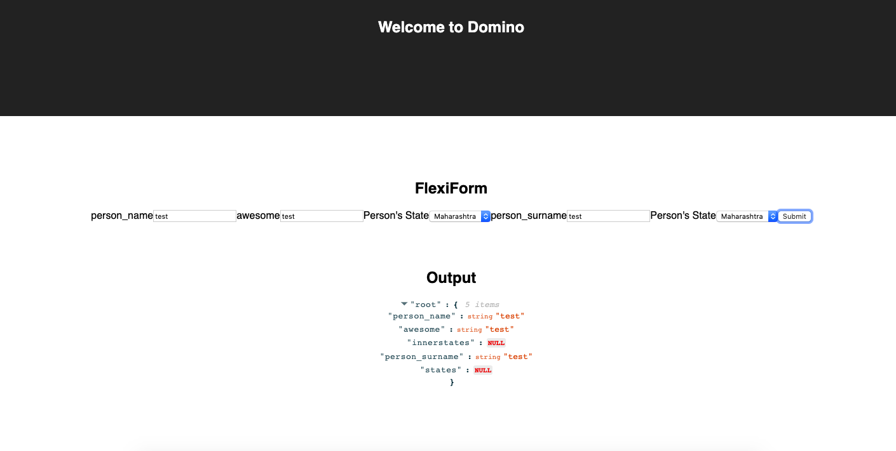

# Flexi Component



# Clone the repo

```
cd ~/path
git clone https://github.com/parthakonda/react-flexi-component.git
```

# Install dependencies
```
cd ~/path/react-flexi-component/react-flexi-component/
npm install
```

# Run the app
```
cd ~/path/react-flexi-component/react-flexi-component/
npm start
```

# Visit http://localhost:3000